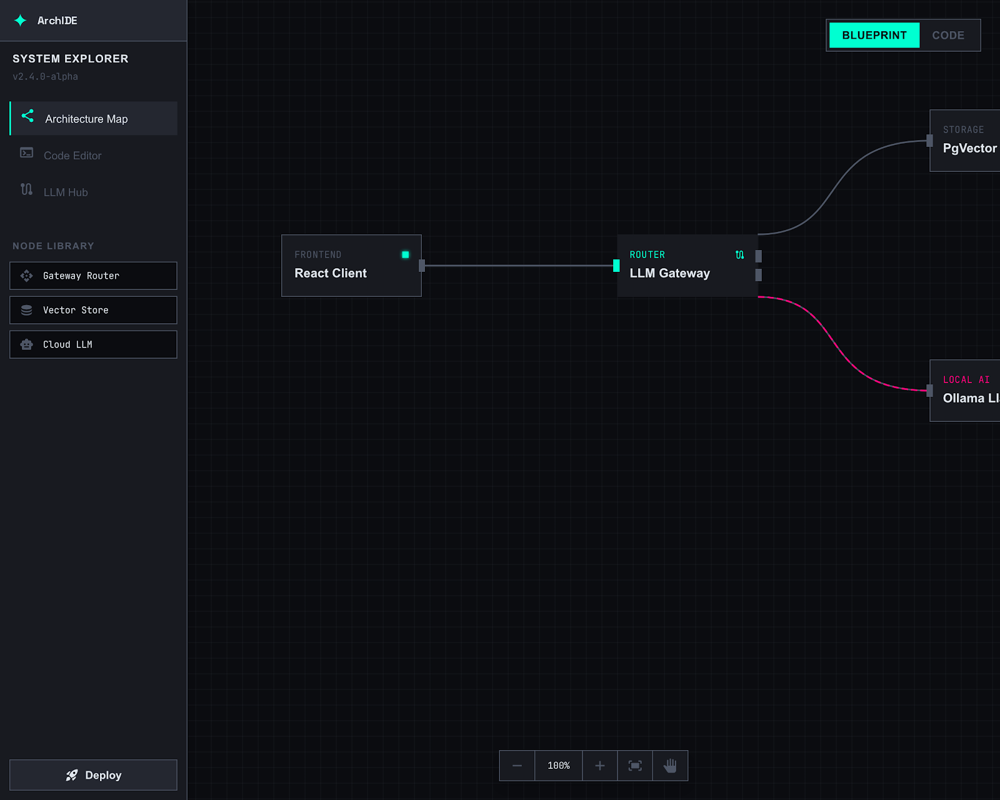

# Neon Protocol IDE

[](LICENSE)
[](package.json)
[](https://nodejs.org/)
[]()

A blueprint-first IDE that bridges architectural design and code implementation, with built-in AI orchestration, full Git integration, and a progressive learning system.



## What Makes It Different

Most IDEs start with files. Neon Protocol starts with architecture. Open any codebase and see it as a visual map of interconnected systems before touching a single line of code.

- **See your app's structure** as an interactive node graph, auto-generated from your codebase
- **Edit code** in a Monaco-powered editor with an AI copilot sidebar
- **Connect any AI** provider (local or cloud) with priority-based fallback routing
- **Use Git natively** — stage, commit, push, pull, branch, diff, stash — all from the sidebar
- **Learn as you go** with guided lessons, interactive tutorials, and an inline glossary

## Features

### Visual Architecture Map
Interactive ReactFlow canvas that auto-discovers your project structure. Files are grouped into architectural nodes (UI, API, Data, Logic) with import-based edges showing how they connect. Drag to rearrange, click to explore.

### Code Editor
Monaco Editor with syntax highlighting, IntelliSense, multi-tab editing, and an AI copilot panel that reads your current file and answers questions in context.

### AI Orchestration
Connect local or cloud AI providers. Configure multiple providers with priority ordering — if the first fails, the system automatically falls back to the next. Track token usage per provider.

### Git Integration
Full source control built into the sidebar:
- **Stage/unstage** files individually or all at once
- **Commit** with message (Ctrl+Enter)
- **Push/pull** to and from remotes
- **Branch** switcher in the footer — search, create, checkout
- **Diff viewer** — side-by-side Monaco diff (HEAD vs working copy)
- **Git log** — browse recent commit history
- **Stash** — save and restore work in progress
- **File indicators** — M/A/D/U badges in the file tree
- **Remote tracking** — ahead/behind count on the branch indicator

### Learning System
Progressive education system for beginners:
- **3 learning tracks** with 13 lessons (Coding Basics, Architecture, LLM Orchestration)
- **Interactive tutorials** with spotlight UI and step-by-step guidance
- **Inline glossary** with 40+ terms, cross-referenced and searchable
- **Progress tracking** with per-track progress bars and a completion flow
- **Beginner/experienced modes** — toggle in the footer to show or hide scaffolding

## Tech Stack

| Layer | Technology |
|-------|-----------|
| Framework | Next.js 14+, React, TypeScript |
| Styling | Tailwind CSS |
| Visual Map | ReactFlow |
| Editor | Monaco Editor |
| State | Zustand (persisted) |
| Desktop | Electron |
| AI | OpenAI-compatible, Anthropic-compatible, and Ollama APIs |

## Getting Started

### One-Click Setup

**Windows:** Double-click `start.bat`

**macOS/Linux:**
```bash
chmod +x start.sh
./start.sh
```

### Manual Setup

```bash
git clone https://github.com/salahuddinuqaili/neon-protocol-ide.git
cd neon-protocol-ide
npm install
npm run dev
```

Requires Node.js v18+.

### Desktop App

```bash
npm run electron-build          # Current OS
npm run electron-build:win      # Windows
npm run electron-build:mac      # macOS
npm run electron-build:all      # All platforms
```

## Project Structure

```
src/
  components/
    blueprint/       Visual map (ReactFlow nodes, edges, canvas)
    editor/          Monaco code editor + copilot panel
    orchestrator/    AI provider configuration + test console
    git/             Source control panel, diff viewer, branch switcher
    layout/          Header, sidebar, footer, main layout
    learning/        Learning path, glossary, concept tooltips
    onboarding/      Welcome screen, tutorials, view hints
    search/          Quick open (Ctrl+P), global search
    settings/        Settings panel (Ctrl+,)
    notifications/   Toast system
  store/             Zustand state management
  hooks/             Custom hooks (git polling)
  lib/               AI provider routing
  data/              Lessons, glossary, tutorials, demo project
  types/             TypeScript interfaces
  electron/          Preload bridge
```

## Contributing

See [CONTRIBUTING.md](CONTRIBUTING.md) for guidelines.

## License

MIT — see [LICENSE](LICENSE).
