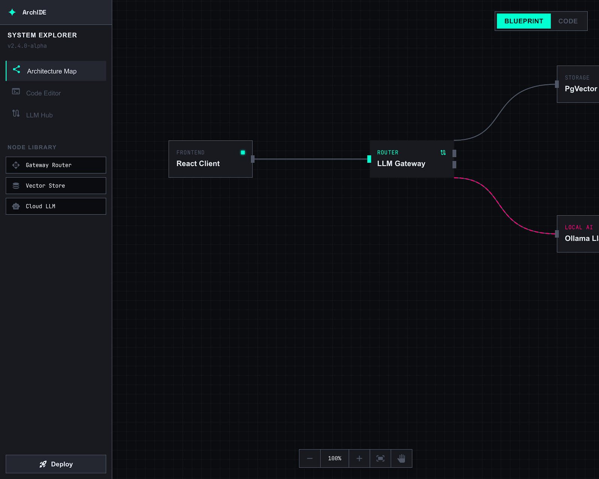

# Neon Protocol IDE

[](LICENSE)
[](package.json)
[](https://nodejs.org/)
[]()

A desktop IDE built entirely through AI-directed development — from architecture to shipping. Designed to let non-traditional engineers see, understand, and modify codebases through visual maps and conversational AI, without writing code by hand.



## Why This Exists

Most developer tools assume you already know how to code. Neon Protocol assumes you know what you want to build. It replaces the blank-file-and-cursor starting point with an interactive architecture map, an AI copilot that explains code in plain language, and a guided learning system that teaches the underlying concepts as you work.

The entire application — 55 TypeScript/React source files, 9,800+ lines across 13 component directories, a modular Electron backend with 38 IPC handlers, and a CI/CD pipeline shipping cross-platform installers — was built without writing a single line of code manually. Every component, every store slice, every IPC handler was directed through AI prompts and iterative refinement.

## What It Does

### Visual Architecture Map
Opens any codebase as an interactive node graph. Files are auto-grouped into architectural categories (UI, API, Data, Logic) with import-based edges showing real dependencies. Click any node to ask the AI copilot about it.

### Monaco Code Editor
Full-featured editor with bracket pair colorization, sticky scroll, indent guides, cursor position tracking, and an integrated AI copilot sidebar. The copilot reads your current file context and adapts its explanations based on whether you're a beginner or experienced.

### Provider-Neutral AI Orchestration
Connect any combination of local (Ollama) and cloud (OpenAI-compatible, Anthropic-compatible) AI providers. Configure priority ordering with automatic failover — if your primary provider is unavailable, the system routes to the next. API keys never touch the renderer process; all LLM calls go through Electron's main process via IPC.

### Native Git Integration
Full source control workflow built into the sidebar — not a terminal wrapper, but a purpose-built UI:
- Stage, unstage, and discard individual files
- Commit with message, or commit-and-push in one click
- Branch switcher with search, create, and checkout
- Side-by-side diff viewer (HEAD vs working copy)
- Stash management, remote tracking (ahead/behind), git log
- File tree indicators (M/A/D/U) with beginner-friendly labels

### Integrated Terminal
Run commands directly in your project directory. Process management with 5-minute timeouts and 5MB output buffers to prevent runaway processes.

### Progressive Learning System
Built-in education system with 4 tracks and 19 lessons:
- **Coding Basics** (4 lessons) — variables, functions, data structures
- **Architecture** (3 lessons) — modules, dependencies, system design
- **LLM Orchestration** (8 lessons) — prompting, vibe coding, spotting AI mistakes
- **Git & Collaboration** (4 lessons) — commits, branches, teamwork

Includes interactive tutorials with spotlight UI, a searchable glossary of 43 terms with cross-references, and a beginner/experienced mode toggle that adapts the entire UI — from copilot system prompts to git status labels.

## Architecture

| Layer | Technology | Detail |
|-------|-----------|--------|
| Desktop Runtime | Electron | Modular IPC: `fs.js`, `git.js`, `llm.js`, `terminal.js` |
| UI Framework | Next.js 16, React 19 | Static export served via local HTTP in production |
| Styling | Tailwind CSS | Custom neon-blueprint design system |
| Visual Map | ReactFlow | Auto-generated nodes with memoized edge computation |
| Code Editor | Monaco Editor | Custom theme, bracket colorization, sticky scroll |
| State | Zustand | 6 slices with versioned persistence and migration |
| AI Routing | IPC-first | API keys isolated in main process, never in renderer |
| Testing | Vitest | 27 tests across store, LLM routing, and SSR safety |
| CI/CD | GitHub Actions | Automated builds shipping `.exe`, `.dmg`, `.zip` per release |

## Getting Started

### Download

Grab the latest installer from [Releases](https://github.com/salahuddinuqaili/neon-protocol-ide/releases):
- **Windows**: `NeonProtocolIDE-x.x.x-Setup.exe` or portable `.exe`
- **macOS**: `.dmg` for Apple Silicon (arm64) or Intel (x64)

### Build from Source

```bash
git clone https://github.com/salahuddinuqaili/neon-protocol-ide.git
cd neon-protocol-ide
npm install
npm run dev              # Browser mode (http://localhost:3001)
npm run electron-dev     # Desktop mode
```

Requires Node.js v18+.

### Build Installers

```bash
npm run electron-build          # Current OS
npm run electron-build:win      # Windows
npm run electron-build:mac      # macOS
npm run electron-build:all      # All platforms
```

## Project Structure

```
index.js                  Electron entry (55 LOC — wiring only)
src/
  electron/
    ipc/                  Modular IPC handlers (fs, git, llm, terminal)
    preload.js            38-method bridge to renderer
    server.js             Static file server for production
  components/
    blueprint/            Visual map (ReactFlow canvas, custom nodes)
    editor/               Monaco editor + AI copilot panel
    orchestrator/         AI provider config + test console
    git/                  Source control, diff viewer, branch switcher
    terminal/             Integrated terminal with process management
    layout/               Header, sidebar, footer, main layout
    learning/             Learning path, glossary, concept tooltips
    onboarding/           Welcome screen, tutorials, view hints
    search/               Quick open (Ctrl+P), global search (Ctrl+Shift+F)
    settings/             Settings panel (Ctrl+,)
    notifications/        Toast system
    copilot/              Module explorer (architecture copilot)
  store/                  Zustand: 6 slices (file, git, llm, learning, ui, editorChat)
  config/                 Language maps, git colors, icons, provider presets, education
  data/                   19 lessons, 43 glossary terms, tutorials, demo project
  lib/                    LLM provider routing, blueprint graph builder
  hooks/                  Git polling with exponential backoff, focus trapping
  types/                  TypeScript interfaces + Electron API types
  test/                   Vitest setup, helpers, SSR safety scanner
```

## Contributing

See [CONTRIBUTING.md](CONTRIBUTING.md) for guidelines.

## License

MIT — see [LICENSE](LICENSE).
